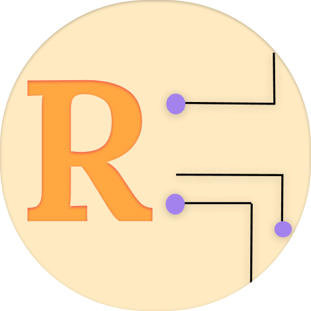

<h1 align="center">Remember</h1>

Store new words that you learn along with their pronunciation! Build your vocab!

Store new words that you learn along with their pronunciation! Build your vocab!
&nbsp;&nbsp;&nbsp;&nbsp;&nbsp;&nbsp;&nbsp;&nbsp;&nbsp;&nbsp;&nbsp;&nbsp;&nbsp;&nbsp;&nbsp;&nbsp;&nbsp;&nbsp;&nbsp;

You can:

1. Add new words that you learn
2. Add word meanings
3. Add your own pronunciation for the words you store

A simple app designed to help you manage your vocabulary and track your progress in learning new words.  
Contains no ads at all!
